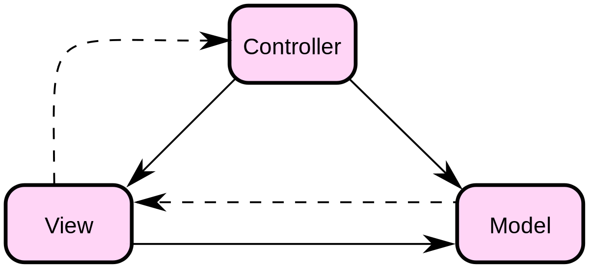

# EmailClient
JavaFX E-Mail Client

## Synchronisieren des Repositories in einen Ordner

Installiere die neueste Version von [git](https://git-scm.com/downloads) mit den Standardeinstellungen.<br/>
Gehe danach in die Windows Eingabeaufforderung (cmd) und führe in einem geeigneten Ordner den Befehl aus:
```
git clone https://github.com/maz22374/EmailClient
```
Soll der neueste Stand vom Server geladen werden, führe die Datei *resetGit.cmd* aus.<br/>
**Achtung:** alle lokalen Änderungen werden dabei zurückgesetzt.

<hr>

Diese Anwendung stellt einen E-Mail-Client dar, der mittels **MVC** unterteilt worden ist.

### Model
Das Model beinhaltet die zugrunde liegende `logische Struktur` von Daten in einer Anwendung und wird vom View dargestellt, die damit verbunden ist.<br/>
Dieses Objektmodell enthält *keine* Informationen zur Benutzeroberfläche oder Steuerung.

### View
Die View ist eine Sammlung von Klassen, welches die ***Elemente in der Benutzeroberfläche darstellen*** (alles, was der Benutzer sieht und interagieren kann).<br/>
Sie ist vor allem für die `Darstellung` der Daten aus dem Model und die `Entgegennahme` von Benutzerinteraktionen aus dem Controller zuständig.

### Controller
Der Controller ***verbindet*** das Model und die View miteinander und ist für `Kommunikation` zwischen diesen zwei Klassen zuständig.</br>
Er nimmt ***Benutzeraktionen*** entgegen, wertet diese aus und agiert entsprechend.
<br/><br/>

<br/><br/>
